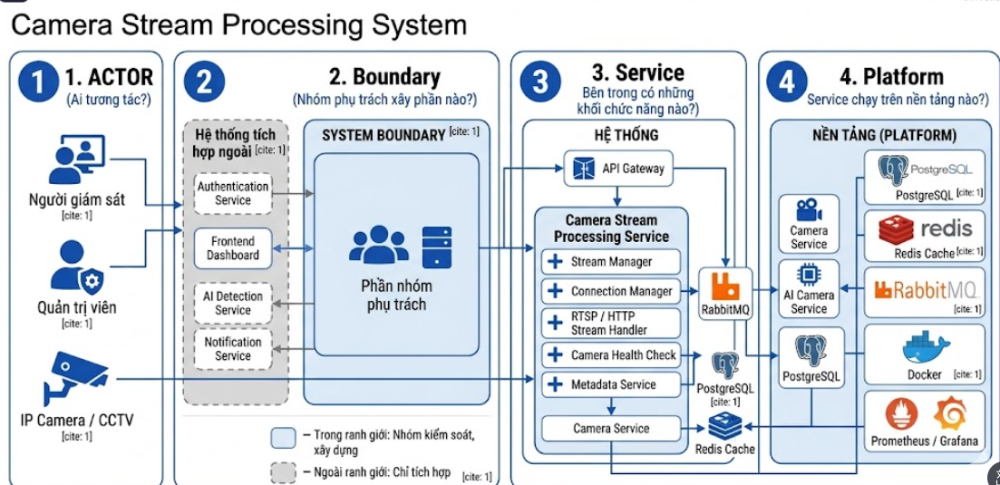
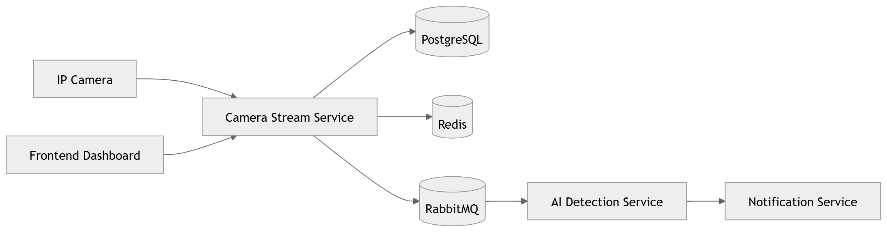

# Tập đoàn Thông tin
- Tên nhóm: Nhóm 7
- Lớp: CNTT 17-09
- Thanh viên:
- Nguyễn Hữu Hưng
- Nhóm dịch vụ phụ:
- Dịch vụ xử lý luồng camera
- Sản phẩm tổng thể của lớp:
- Hệ thống nhận tiếp và thông tin camera xử lý luồng


# Service Communication & Dependency

## 1. Consumer và Provider

### Provider

Service nhóm em đóng vai trò **Provider** vì cung cấp:
- Luồng camera realtime
- API truy cập stream
- Trạng thái camera
- Metadata camera

Các service sử dụng dữ liệu từ nhóm em:
- AI Detection Service
- Frontend Dashboard
- Monitoring Service

---

### Consumer

Service nhóm em đóng vai trò **Consumer** khi sử dụng:
- Authentication Service để xác thực người dùng
- Notification Service để gửi cảnh báo
- Redis để cache trạng thái camera
- PostgreSQL để lưu metadata

---

# 2. Giao tiếp giữa các service

## Giao tiếp REST API

| Service gọi | Service nhận | Mục đích |
|---|---|---|
| Frontend Dashboard | Camera Stream Service | Lấy luồng camera |
| Frontend Dashboard | Authentication Service | Đăng nhập |
| Camera Stream Service | Notification Service | Gửi cảnh báo |
| AI Detection Service | Camera Stream Service | Lấy dữ liệu stream |

---

## Giao tiếp Event-Driven

RabbitMQ được sử dụng để:
- Gửi event camera
- Gửi kết quả AI detection
- Đồng bộ trạng thái service

Ví dụ:
- Camera phát hiện chuyển động
- AI service xử lý
- Notification service gửi cảnh báo realtime

---

# 3. API dự kiến

| Method | Endpoint | Mục đích |
|---|---|---|
| GET | /api/camera/stream | Lấy luồng camera |
| GET | /api/camera/status | Kiểm tra trạng thái camera |
| POST | /api/camera/connect | Kết nối camera |
| DELETE | /api/camera/disconnect | Ngắt kết nối camera |

---

# 4. Dữ liệu trao đổi mẫu

## Request

```json
{
  "cameraId": "cam01"
}

